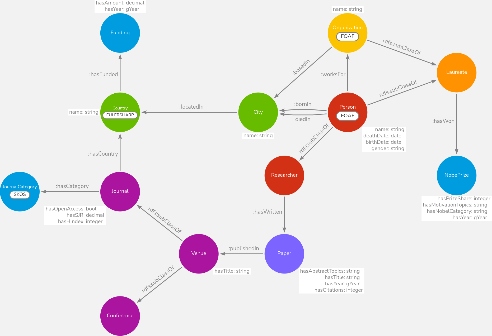

# a3d
Repository for GraphDB project

# Top 8 queries
- papersNobelTopicsYear (plot useless, we'll put sample tables from graphdb)
- papersPerTopic
- sharedNobels
- laureatesCollaborations
- laureatesPerCountryAndFunding
- moreThanOneNobel
- papersPerVenue
- papersPerCategory
